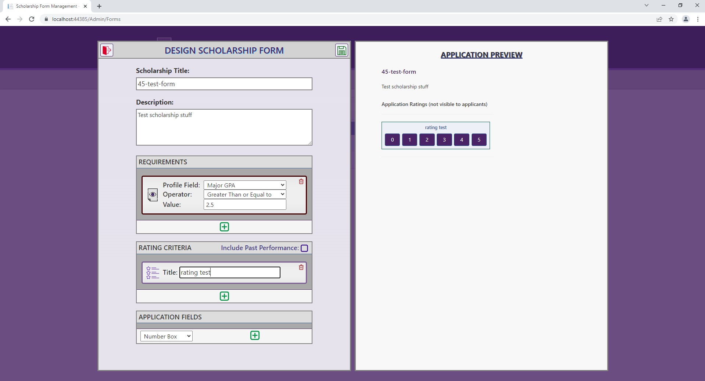
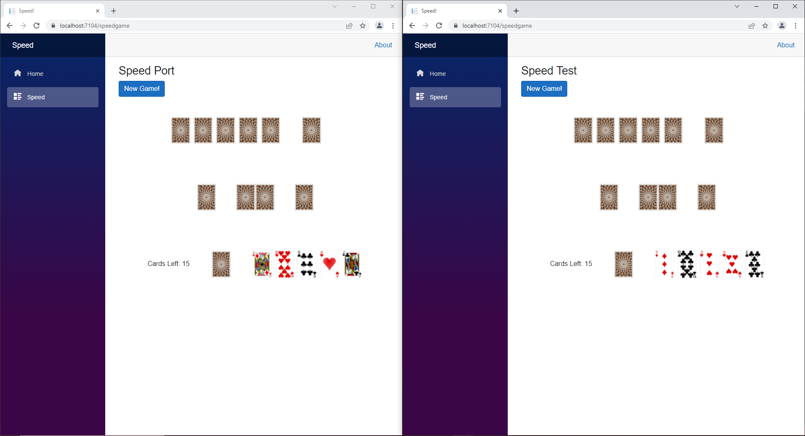

<!-- ## Welcome to GitHub Pages

You can use the [editor on GitHub](https://github.com/16holson/16holson.github.io/edit/main/index.md) to maintain and preview the content for your website in Markdown files.

Whenever you commit to this repository, GitHub Pages will run [Jekyll](https://jekyllrb.com/) to rebuild the pages in your site, from the content in your Markdown files.

### Markdown

Markdown is a lightweight and easy-to-use syntax for styling your writing. It includes conventions for

```markdown
Syntax highlighted code block

# Header 1
## Header 2
### Header 3

- Bulleted
- List

1. Numbered
2. Lis

**Bold** and _Italic_ and `Code` text

[Link](url) and 
```

For more details see [Basic writing and formatting syntax](https://docs.github.com/en/github/writing-on-github/getting-started-with-writing-and-formatting-on-github/basic-writing-and-formatting-syntax).

### Jekyll Themes

Your Pages site will use the layout and styles from the Jekyll theme you have selected in your [repository settings](https://github.com/16holson/16holson.github.io/settings/pages). The name of this theme is saved in the Jekyll `_config.yml` configuration file.

### Support or Contact

Having trouble with Pages? Check out our [documentation](https://docs.github.com/categories/github-pages-basics/) or [contact support](https://support.github.com/contact) and we’ll help you sort it out. -->
# Hunter Olson
# Github Portfolio

## Guessing Game
1. Website that has a login that hashes/salts the password. It is also a hot/cold number guessing game that displays the top ten users. Stores users data to local raspberry pi MySql database.
2. Autor: Hunter Olson
3. Tools Used: PHPStorm, MySql, InfinityFree, Ubuntu.
4. Screenshots:


## Hangman Game
1. Created a web app hangman game that includes authentication, a database, and asynchronous programming with websockets.
2. Authors: Tage Higley, Dennis Chase, Hunter Olson, Cecilia Harvey.
3. Tools Used: ASP.NET Core 6.0, Web Sockets with SignalR, Access Database, Visual Studio.
4. Hunter Olson's Contribution: 
- Designed the Login and Hangman pages.
- Helped with SignalR.
- Added functionality to Hangman page.
- Added top ten functionality.
5. Screenshots:


## Scholarship Project
1. This program was a legacy application that required upgrading to a more recent version of ASP.NET Core. The application was upgraded from ASP.NET Core 2.0 to 6.0. There was a bug that prevented the Entity Framework databases from auto generating that we fixed. We also added a new question to the student profile.
2. Authors: Tage Higley, Dennis Chase, Hunter Olson, Cecilia Harvey
3. Tools Used: ASP.NET Core 6.0, SQL, Entity Framework, Visual Studio
4. Hunter Olson's Contribution: 
- Helped to migrate to dotnet 2.1. 
- Fixed bug that wouldn't allow you to see applications if a judge hasen't rated it.
5. Screenshots:




## Speed Game
1. Created a web app that allows two players to compete in a game of Speed.
2. Authors: Tage Higley, Dennis Chase, Hunter Olson, Cecilia Harvey
3. Tools Used: ASP.NET Core 6.0, Web Sockets with SignalR, Visual Studio
4. Hunter Olson's Contribution: 
- I designed the layout of the cards on the front end.
- I implemented the draw card, play card, and flip new card functions.
- I applied our understanding of SignalR to our project.
5. Screenshots:



